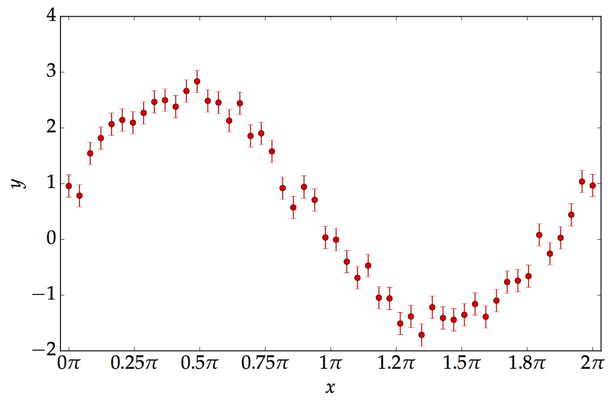
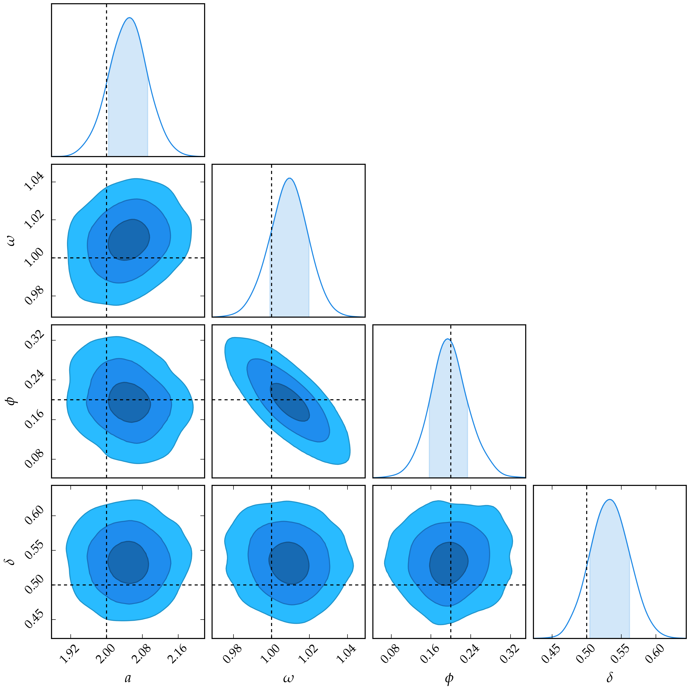

<h1>An Example of MCMC</h1>

<section>
	
As an example, we will use the simple Metropilis-Hastings algorithm to infer the following parameters and model.

## Data

<!--
<iframe src="data_sin.pdf" title="data" align="top" height="100%" width="100%" frameborder="0" scrolling="auto" target="Message">
-->

## Correlation between Parameters

